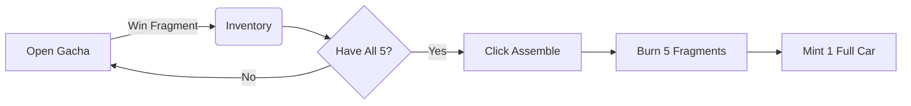

# 🧩 Fragment Assembly

Turn your spare parts into a complete, tradeable NFT car.

---

## 🛠️ How It Works

**Fragment Assembly** is MiniGarage's "bad luck protection" system. Even if you don't win a full car from the Gacha, you will receive **Fragments**.

### The Rule of 5
To craft a complete car, you need **5 specific parts** of the same model:

<table data-card-size="large" data-view="cards">
<thead><tr><th></th><th></th><th></th></tr></thead>
<tbody>
<tr>
<td><strong>1. Chassis</strong></td>
<td>The base frame</td>
<td>Type ID: 0</td>
</tr>
<tr>
<td><strong>2. Wheels</strong></td>
<td> rolling gear</td>
<td>Type ID: 1</td>
</tr>
<tr>
<td><strong>3. Engine</strong></td>
<td>Power unit</td>
<td>Type ID: 2</td>
</tr>
<tr>
<td><strong>4. Body</strong></td>
<td>Exterior shell</td>
<td>Type ID: 3</td>
</tr>
<tr>
<td><strong>5. Interior</strong></td>
<td>Cabin details</td>
<td>Type ID: 4</td>
</tr>
</tbody>
</table>

> **📢 Key Mechanic:** Once you have all 5 parts, you can **burn them** to mint the full Car NFT.

---

## 🔄 The Crafting Loop



1.  **Collect:** Keep opening Gacha boxes. Most result in Fragments.
2.  **Trade:** Missing the *Engine*? Buy it from someone else on the Marketplace.
3.  **Assemble:** Go to Inventory → Fragments → Click "Assemble".
4.  **Own:** The Fragments are destroyed (burned), and a pristine Car NFT is minted to your wallet.

---

## ⚡ Gasless Assembly

Just like our Gacha system, **Crafting is Gasless**.

*   **You sign** a permission to burn the 5 specific fragments.
*   **We pay** the gas fees to execute the transaction.
*   **Result:** You get your car without needing ETH.

---

## 📉 Rarity & Tiers

Fragments also have tiers! You cannot mix and match tiers.

*   **Common Parts** → Craft a **Common Car**
*   **Rare Parts** → Craft a **Rare Car**
*   **Legendary Parts** → Craft a **Legendary Car**

> **Tip:** Legendary parts are extremely hard to find. A full Legendary set is a massive achievement!

---

## 📝 Smart Contract Logic

**Contract:** `BaseWheelsFragments.sol` (ERC-1155)

The assembly process is validated on-chain to ensure you actually own the parts before minting.

```solidity
function burnForAssembly(address user, uint256[] memory fragmentIds) external {
    // 1. Verify user owns all 5 parts
    // 2. Burn the 5 fragments (ERC-1155 burn)
    // 3. Trigger CarNFT mint (ERC-721 mint)
}
```
