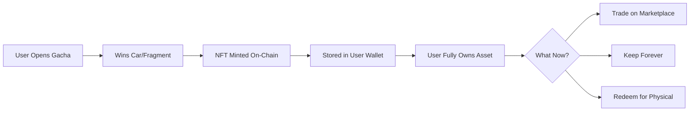
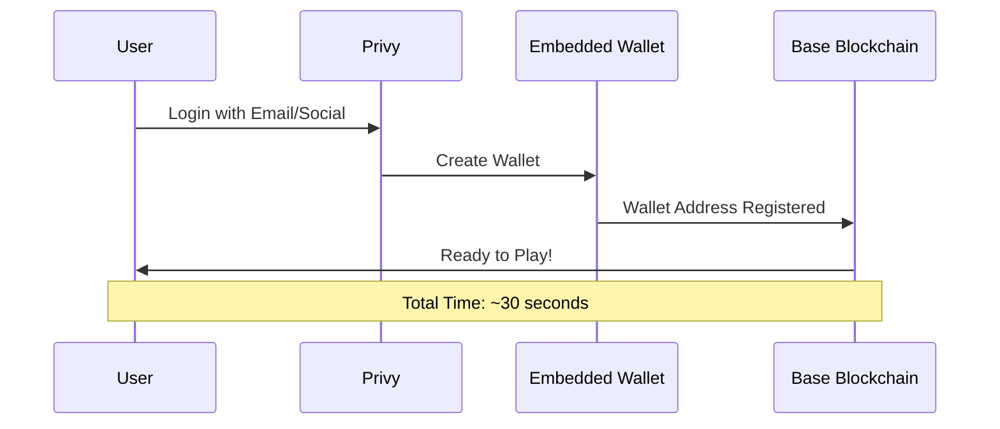
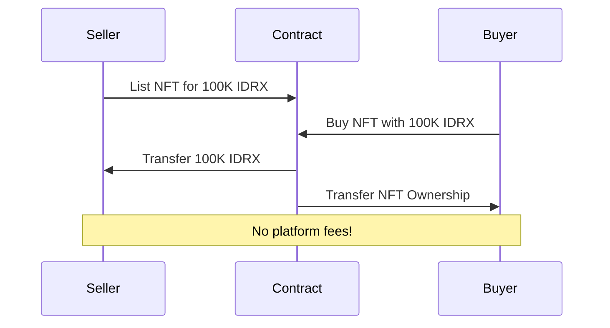

# Problem & Solution

## 🚨 The Problem

Traditional digital collectibles and in-game assets have **three critical flaws** that prevent true ownership and long-term value:

### 1. No True Ownership

<table data-card-size="large" data-view="cards"><thead><tr><th></th><th></th></tr></thead><tbody><tr><td><strong>❌ Traditional Games</strong></td><td>You spend money on in-game items, but the game company owns everything. When the game shuts down, you lose it all.</td></tr><tr><td><strong>✅ MiniGarage</strong></td><td>Every car is an NFT you truly own. Even if our platform closes, your NFTs remain on-chain forever.</td></tr></tbody></table>

**Example:**
> Player spends $500 on rare car skins in a mobile game. Game company decides to shut down the game. **Result:** Player loses everything, no refund, no way to transfer assets.

---

### 2. Complex Crypto Onboarding

<table data-card-size="large" data-view="cards"><thead><tr><th></th><th></th></tr></thead><tbody><tr><td><strong>❌ Most Web3 Games</strong></td><td>Require users to:<br>• Install MetaMask<br>• Write down 12-word seed phrase<br>• Buy ETH for gas<br>• Understand blockchain</td></tr><tr><td><strong>✅ MiniGarage</strong></td><td>Just login with:<br>• Email<br>• Google<br>• Twitter<br>• Discord<br><br>Wallet created automatically!</td></tr></tbody></table>

**Stats:**
- **95% of users** abandon Web3 apps during wallet setup
- **70% of beginners** lose access to wallets within first month
- MiniGarage **reduces onboarding to 30 seconds**

---

### 3. Lack of Gaming Collectibles on Base

<table data-card-size="large" data-view="cards"><thead><tr><th></th><th></th></tr></thead><tbody><tr><td><strong>❌ Current State</strong></td><td>Base has amazing DeFi and social apps, but lacks engaging collectible gaming experiences that bridge Web2 and Web3.</td></tr><tr><td><strong>✅ MiniGarage</strong></td><td>First major NFT car collection game on Base, combining mainstream appeal with blockchain benefits.</td></tr></tbody></table>

---

## ✅ Our Solution

MiniGarage addresses these problems with a **5-pillar approach**:

### 1. True Digital Ownership via NFTs



**Key Benefits:**
- ✅ **Permanent Ownership** - NFTs exist on Base blockchain forever
- ✅ **Provable Scarcity** - On-chain verification of rarity (10 Legendary, 20 Hypercar, 50 Supercar, etc.)
- ✅ **Interoperability** - Works with any NFT marketplace
- ✅ **Transferable** - Gift, sell, or trade freely

---

### 2. Seamless Onboarding with Privy



**How It Works:**
1. User clicks "Login with Google"
2. Google OAuth authenticates
3. Privy generates embedded wallet
4. Wallet keys encrypted with user's OAuth token
5. User gets Base address automatically

**No Need For:**
- ❌ MetaMask installation
- ❌ Seed phrase management
- ❌ Gas fee confusion
- ❌ Network switching

---

### 3. Gasless UX with MockIDRX

Instead of requiring users to have ETH for every transaction, we use **IDRX tokens**:

| Action | Traditional Web3 | MiniGarage |
|--------|------------------|------------|
| **Open Gacha Box** | Pay 0.001 ETH (~$2) + gas | Pay 25K IDRX (free from faucet) |
| **Mint NFT** | User pays gas (~$0.50) | Backend sponsors gas (FREE) |
| **Trade NFT** | Pay listing price + gas | Pay IDRX only, no gas |
| **Claim Physical** | User pays gas | Backend sponsors gas (FREE) |
| **Fragment Assembly** | User pays gas | Backend sponsors gas (FREE) |

**Gasless Transactions:**
- ✅ **Gacha box opening** - Backend sponsors minting gas
- ✅ **NFT minting** - Completely free for users
- ✅ **Fragment assembly** - No gas fees to create complete car
- ✅ **Physical redemption** - Sponsored by platform

**Benefits:**
- ✅ Users never see gas fees
- ✅ Predictable costs in IDRX
- ✅ Familiar denominations (1M IDRX vs 0.0001 ETH)
- ✅ Cultural connection for Indonesian market

---

### 4. Fragment Crafting System

Unlike pure-RNG gacha games, MiniGarage adds **progression**:

```
Pure RNG (Traditional Gacha):
┌─────────┐
│ Open Box│ → Random Car (0.1% legendary)
└─────────┘
❌ Frustrating for unlucky players

MiniGarage (Fragment + RNG):
┌─────────┐     ┌──────────┐     ┌────────────┐
│ Open Box│ →  │ Fragment │  →  │ Collect 5  │ → Complete Car
└─────────┘     └──────────┘     └────────────┘
✅ Progress toward guaranteed reward
```

**How It Works:**
- Collect 5 fragment types: Engine, Chassis, Wheels, Body, Electronics
- Each fragment belongs to a specific car brand (e.g., Ferrari, Lamborghini)
- Assemble complete set → Get NFT car of that brand
- Choose to keep digital OR burn for physical diecast

**Advantages:**
- ✅ **Reduces RNG Frustration** - Every pull has value
- ✅ **Adds Progression** - Work toward specific cars
- ✅ **Guaranteed Rewards** - Collect enough fragments = guaranteed car
- ✅ **Increases Engagement** - Collection goals and milestones

---

### 5. Bridge to Physical World (RWA)

**This is what makes MiniGarage unique:** Unlike pure digital NFTs, every car is **backed by a real physical diecast collectible**.

```
Digital Collecting Phase          Physical Redemption Phase
┌──────────────┐                 ┌──────────────┐
│   Own NFT    │                 │  Burn NFT    │
│   Digital    │  ────────────►  │   On-Chain   │
│   Forever    │                 │  Permanent   │
└──────────────┘                 └──────────────┘
                                        │
                                        ▼
                                 ┌──────────────┐
                                 │ Receive Real │
                                 │   Diecast    │
                                 │   at Home    │
                                 └──────────────┘
```

**How It Works:**
1. **Collect** - Win NFT cars from gacha or marketplace
2. **Choose** - Keep digital or claim physical
3. **Shipping Info** - Enter delivery address (one-time)
4. **Burn NFT** - Permanently remove from blockchain
5. **Receive Physical** - Real diecast car shipped to you

**Benefits:**
- ✅ **Real Value** - Not just pixels, backed by physical collectible
- ✅ **Verifiable Authenticity** - Blockchain proves ownership history
- ✅ **Collector's Dream** - Bridge digital collecting with physical ownership
- ✅ **Deflationary Supply** - Every redemption reduces NFT circulation
- ✅ **Proof of Rarity** - On-chain record of total minted vs redeemed

**Example User Journey:**
```
1. User wins Legendary Ferrari NFT from gacha
2. Trades it on marketplace for 500K IDRX
3. Buys Lamborghini NFT they really want
4. Enters shipping info
5. Burns Lamborghini NFT to claim physical
6. Receives authentic diecast at home
7. NFT supply decreases, increasing value for remaining holders
```

---

### 6. P2P Trading Marketplace

Trade cars with other collectors **without intermediaries**:

**Key Features:**
- **Zero Platform Fees** - Pure peer-to-peer trading
- **IDRX Payments** - Use in-game currency (no ETH needed)
- **Supply Cap Enforcement** - Smart contract ensures scarcity
- **Browse by Rarity** - Filter: Legendary, Epic, Rare, Common
- **Instant Transactions** - Buy/sell immediately
- **Price Discovery** - See what others are selling for

**Marketplace Flow:**


**Why P2P Matters:**
- ✅ **True Ownership** - You control your assets
- ✅ **Fair Pricing** - Market decides value
- ✅ **Transparent History** - All trades on-chain
- ✅ **No Middleman** - Direct collector-to-collector

---

## 🎯 Impact

### Before MiniGarage

```
User Journey (Traditional Games):
1. Install game → 10 min
2. Make in-game purchases → $100
3. Game shuts down → Lose everything
4. User frustrated → Never trusts again
```

### With MiniGarage

```
User Journey (MiniGarage):
1. Login with email → 30 sec
2. Claim free IDRX → 1 min
3. Open gacha boxes → 5 min
4. Own NFTs forever → Lifetime value
5. Trade OR redeem physical → Full control
6. NFT remains on-chain even if platform closes
```

---

## 📊 Comparison

| Feature | Traditional Games | Other Web3 Games | MiniGarage |
|---------|-------------------|------------------|------------|
| **True Ownership** | ❌ No | ✅ Yes | ✅ Yes |
| **Easy Onboarding** | ✅ Yes | ❌ No | ✅ Yes |
| **Low/No Gas Fees** | ✅ Yes | ❌ No | ✅ Yes |
| **Progression System** | ✅ Yes | ⚠️ Rare | ✅ Yes |
| **Blockchain Benefits** | ❌ No | ✅ Yes | ✅ Yes |
| **Physical Redemption** | ❌ No | ❌ No | ✅ Yes (RWA) |
| **P2P Marketplace** | ❌ No | ⚠️ Limited | ✅ Zero Fees |
| **Supply Transparency** | ❌ No | ⚠️ Some | ✅ On-Chain |

---

## 🎮 Complete User Experience

```
New User Flow:
┌────────────────┐
│ Login (30 sec) │
└────────┬───────┘
         │
         ▼
┌────────────────┐
│ Claim Free     │
│ IDRX Tokens    │
└────────┬───────┘
         │
         ▼
┌────────────────┐     ┌────────────────┐
│ Open Gacha     │────▶│ Win Fragments  │
│ Boxes          │     │ or Complete    │
└────────────────┘     │ Cars           │
                       └────────┬───────┘
                                │
                ┌───────────────┼───────────────┐
                │               │               │
                ▼               ▼               ▼
         ┌──────────┐    ┌──────────┐   ┌──────────┐
         │ Assemble │    │  Trade   │   │   Keep   │
         │ Fragments│    │   NFT    │   │  Digital │
         └─────┬────┘    └─────┬────┘   └──────────┘
               │               │
               └───────┬───────┘
                       │
                       ▼
              ┌─────────────────┐
              │ Complete NFT Car│
              └────────┬─────────┘
                       │
         ┌─────────────┴─────────────┐
         │                           │
         ▼                           ▼
┌────────────────┐          ┌────────────────┐
│  Keep Digital  │          │ Burn for       │
│  (tradeable)   │          │ Physical       │
└────────────────┘          └────────┬───────┘
                                     │
                                     ▼
                            ┌────────────────┐
                            │ Real Diecast   │
                            │ Delivered      │
                            └────────────────┘
```

---


**MiniGarage = Best of Three Worlds**

We combine:
1. **Accessibility** of traditional games (easy login, no crypto knowledge)
2. **Ownership** of Web3 (true NFT ownership, forever on-chain)
3. **Physical Value** of RWA (burn NFT → receive real diecast)

Without the usual friction.


---


**Key Innovation: Digital-First, Physical-Optional**

Unlike traditional collectibles where you must buy physical first, MiniGarage lets you:
- Collect digitally (instant, gasless)
- Trade freely (P2P marketplace)
- Claim physical only when you want (burn NFT)

This reduces shipping costs, enables global trading, and gives collectors full flexibility.


---

## Next: Why Base?

Learn why we chose Base blockchain for optimal performance and cost efficiency →


[why-base.md](why-base.md)

