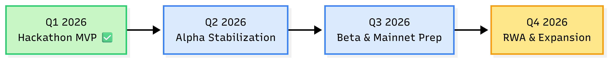

# 🗺️ Roadmap

MiniGarage development roadmap.

***

## 🟢 Q1 2026 — Hackathon MVP (Completed) ✅

**Timeline:** Dec 2025 – Jan 2026

This phase validates the **core product loop**:

> **Gacha → Fragment → Assembly → Trade → Ownership**

### Delivered

#### Core Gameplay

* ✅ IDRX-based Gacha System
* ✅ Fragment Assembly (burn fragments → mint car NFT)
* ✅ Car NFT & Fragment NFT smart contracts
* ✅ Rarity system (Common → Legendary)

#### Ownership & Trading (MVP)

* ✅ User-owned NFTs (minted directly to user wallets)
* ✅ Backend-coordinated marketplace (MVP)
* ✅ Users can sell their own NFTs (approval-based, non-custodial)
* ✅ MockIDRX (ERC-20) on Base Sepolia

#### UX & Infrastructure

* ✅ Base Mini App integration
* ✅ Gas-sponsored transactions (user-friendly UX)
* ✅ Inventory & activity history

> **Outcome:**\
> A fully playable Web3 collectible game with real ownership and on-chain assets.

***

## 🟡 Q2 2026 — Alpha Stabilization

**Focus:** Security, UX polish, and early community traction

### Goal

> Make MiniGarage **stable, understandable, and trustworthy** for early adopters.

***

### 🔐 Security & Reliability

* Smart contract review & internal audit
* Admin wallet migration to **multi-sig**
* Rate limiting (faucet, gacha, marketplace)
* Incident response & rollback plan

***

### 🎮 UX & Gameplay Improvements

* Interactive onboarding tutorial
* Clear gacha odds & rarity indicators
* Collection progress (% completion per series)
* Achievement & badge system (basic)

***

### 🏪 Marketplace V2 — User-Owned Listings

> **Key Upgrade:** Marketplace evolves fully into **user-owned trading**.

* Users list and sell **their own NFTs**
* NFTs remain in **user wallets** (non-custodial)
* Listing via **approval-based selling** (no NFT deposits)
* Users freely set prices in IDRX
* Platform facilitates settlement only (2.5% service fee)

**Important:**\
Users **do NOT send NFTs to admin** to sell them.

***

### 👥 Community

* Public user profiles
* Collector & trader leaderboards
* Social sharing (gacha results & collections)

***

## 🔵 Q3 2026 — Beta, Mainnet & RWA Preparation

**Focus:** Fairness, scalability, and real-world asset readiness

### Goal

> Prepare MiniGarage for **real users and real value** on mainnet.

***

### ⛓️ Mainnet Readiness

* Deploy contracts to **Base Mainnet**
* Meta-transactions (gas sponsorship)
* Emergency pause / circuit breaker
* Upgrade strategy (UUPS / proxy)

***

### 🎲 Fair & Transparent Gacha

* Chainlink VRF (provably fair RNG)
* Transparent supply caps per car model
* On-chain mint counters tied to **real-world inventory**

***

### 💰 Economy & Trust

* Finalize IDRX strategy (stablecoin / pricing layer)
* Treasury transparency dashboard
* Marketplace fee tuning based on real usage data

***

### 📦 RWA Foundations

* Physical inventory mapping (off-chain ↔ on-chain)
* Redemption logic design (NFT → physical)
* Immutable on-chain redemption records

***

## 🟣 Q4 2026 — RWA & Ecosystem Expansion

**Focus:** Physical assets, retention, and platform differentiation

### Goal

> Transform MiniGarage into a **digital-first RWA collectibles platform**.

***

### 🚚 Physical Redemption (V1)

* Burn NFT → claim physical die-cast
* Shipping workflow (limited regions)
* Redemption status tracking
* Proof of authenticity (QR / serial)

***

### 🎮 Gameplay Expansion

* Car attributes (cosmetic & stats)
* Limited edition & seasonal drops
* Brand or community collaborations

***

### 🌍 Platform Growth

* External wallet support (WalletConnect)
* Cross-platform access (beyond Mini App)
* Partner integrations (brands, creators, communities)

***

## 📊 Roadmap Overview Diagram

